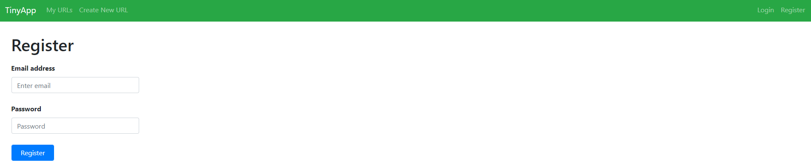
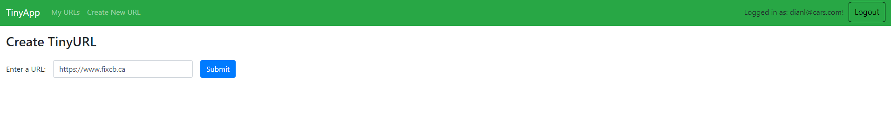
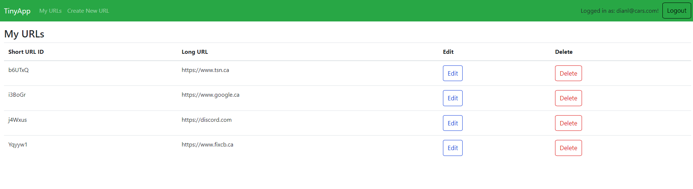

# TinyApp Project

TinyApp is a full stack web application built with Node and Express that allows users to shorten long URLs (à la bit.ly).

## Final Product

_Register Page for Inactive Users_

_Create TinyURL Page for Active Users_

_URLs Page for Active Users_

## Dependencies

- Node.js
- Express
- EJS
- bcryptjs
- cookie-session

## Getting Started

1. Install all dependencies (using the `npm install` command).
2. Run the development web server using the `node express_server.js` command.
3. Run `http://localhost:8080` on browser.

## How to Use TinyApp

#### Register and Login Page

- In order view or edit URLs, you must register and proceed to log in
- On the upper right coner, click _"Register"_ and add an email and password

#### Create URLs Link

- When logged in, click _"Create New URL"_ located in the navigaton bar
- Once inside the _"Create New URL"_, enter a URL and once implemented, click submit

#### Delete and Edit Link

- Navigate to the _"My URLs"_ in the naviagtion bar
- Select the URL you desire to modify that you have created and select _"Edit"_
- Once in the _"Edit"_ page, update your link, click submit and it will be redirected to the _"My URLs"_ page
- To delete user's URL, click _"Delete"_ to remove link

## Conclusion

Thank you for checking out my Tinyapp project!

---

Project by [Diana](https://github.com/dialop/tinyapp) as a part of the Lighthouse Labs program curriculum.
